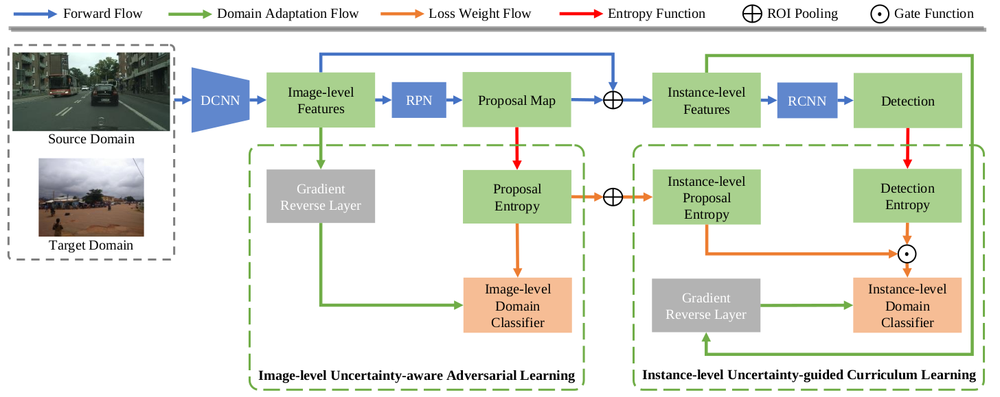

# Uncertainty-Aware Unsupervised Domain Adaptation in Object Detection

## Updates

- *06/2021*: check out our domain adaptation for panoptic segmentation paper [Cross-View Regularization for Domain Adaptive Panoptic Segmentation](https://arxiv.org/abs/2103.02584) (accepted to CVPR 2021). We design a domain adaptive panoptic segmentation network that exploits inter-style consistency and inter-task regularization for optimal domain adaptation in panoptic segmentation.[Code avaliable](https://github.com/jxhuang0508/FSDR).
- *06/2021*: check out our domain generalization paper [FSDR: Frequency Space Domain Randomization for Domain Generalization](https://arxiv.org/abs/2103.02370) (accepted to CVPR 2021). Inspired by the idea of JPEG that converts spatial images into multiple frequency components (FCs), we propose Frequency Space Domain Randomization (FSDR) that randomizes images in frequency space by keeping domain-invariant FCs (DIFs) and randomizing domain-variant FCs (DVFs) only. [Code avaliable](https://github.com/jxhuang0508/CVRN).
- *06/2021*: check out our domain adapation for sematic segmentation paper [Scale variance minimization for unsupervised domain adaptation in image segmentation](https://www.researchgate.net/publication/347421562_Scale_variance_minimization_for_unsupervised_domain_adaptation_in_image_segmentation)(accepted to Pattern Recognition 2021). We design a scale variance minimization (SVMin) method by enforcing the intra-image semantic structure consistency in the target domain. [Code avaliable](https://github.com/Dayan-Guan/SVMin).


## Paper

[Uncertainty-Aware Unsupervised Domain Adaptation in Object Detection](https://arxiv.org/abs/2103.00236)  
 [Dayan Guan](https://scholar.google.com/citations?user=9jp9QAsAAAAJ&hl=en)<sup>1</sup>, [Jiaxing Huang](https://scholar.google.com/citations?user=czirNcwAAAAJ&hl=en&oi=ao)<sup>1</sup>, [Xiao Aoran](https://scholar.google.com/citations?user=yGKsEpAAAAAJ&hl=en)<sup>1</sup>, [Shijian Lu](https://scholar.google.com/citations?user=uYmK-A0AAAAJ&hl=en)<sup>1</sup>, [Yanpeng Cao](https://dblp.org/pid/91/7629.html)<sup>2</sup>
 
 <sup>1</sup>School of Computer Science Engineering, Nanyang Technological University, Singapore  
 <sup>2</sup>School of Mechanical Engineering, Zhejiang University, Hangzhou, China.
 
 IEEE Transactions on Multimedia, 2021.
 
If you find this code useful for your research, please cite our [paper](https://arxiv.org/abs/2103.00236):

```
@article{guan2021uncertainty,
  title={Uncertainty-aware unsupervised domain adaptation in object detection},
  author={Guan, Dayan and Huang, Jiaxing and Xiao, Aoran and Lu, Shijian and Cao, Yanpeng},
  journal={IEEE Transactions on Multimedia},
  year={2021},
  publisher={IEEE}
}
```

## Abstract

Unsupervised domain adaptive object detection aims to adapt detectors from a labelled source domain to an unlabelled target domain. Most existing works take a two-stage strategy that first generates region proposals and then detects objects of interest, where adversarial learning is widely adopted to mitigate the inter-domain discrepancy in both stages. However, adversarial learning may impair the alignment of well-aligned samples as it merely aligns the global distributions across domains. To address this issue, we design an uncertainty-aware domain adaptation network (UaDAN) that introduces conditional adversarial learning to align well-aligned and poorly-aligned samples separately in different manners. Specifically, we design an uncertainty metric that assesses the alignment of each sample and adjusts the strength of adversarial learning for well-aligned and poorly-aligned samples adaptively. In addition, we exploit the uncertainty metric to achieve curriculum learning that first performs easier image-level alignment and then more difficult instance-level alignment progressively. Extensive experiments over four challenging domain adaptive object detection datasets show that UaDAN achieves superior performance as compared with state-of-the-art methods. 

## Installation
```bash
conda env create -f environment.yaml
conda activate uadan
python setup.py build develop
pip install torchvision==0.2.1
```

### Prepare Dataset
* **Pascal VOC**: Download [Pascal VOC dataset](https://pjreddie.com/projects/pascal-voc-dataset-mirror) at ```UaDAN/dataset/voc```
* **Clipart1k**: Download [Clipart1k dataset](http://www.hal.t.u-tokyo.ac.jp/~inoue/projects/cross_domain_detection/datasets/clipart.zip) at ```UaDAN/dataset/clipart``` and unzip it
(Clipart1k dataset contains 1,000 comical images, in which 800 for training and 200 for validation.)
```bash
mv tools/dataset/clipart/ImageSets dataset/clipart
```
* **Cityscapes**: Download [Cityscapes dataset](https://www.cityscapes-dataset.com) at ```UaDAN/dataset/cityscapes```
* **Mapillary Vista**: Download [Mapillary Vista dataset](https://www.mapillary.com/dataset/vistas) at ```UaDAN/dataset/vistas```

### Pre-trained models
Pre-trained models can be downloaded [here](https://github.com/Dayan-Guan/UaDAN/releases/tag/Latest) and put in ```UaDAN/pretrained_models```

### Evaluation
```bash
python tools/test_net.py --config-file "configs/UaDAN_Voc2Clipart.yaml" MODEL.WEIGHT "pretrained_models/UaDAN_Voc2Clipart.pth"
```

```bash
python tools/test_net.py --config-file "configs/UaDAN_City2Vistas.yaml" MODEL.WEIGHT "pretrained_models/UaDAN_City2Vistas.pth"
```

### Training
```bash
python tools/train_net.py --config-file "configs/UaDAN_voc2clipart.yaml"
```

```bash
python tools/test_net_all.py --config-file "configs/UaDAN_voc2clipart.yaml"
```

## Acknowledgements
This codebase is heavily borrowed from [maskrcnn-benchmark](https://github.com/facebookresearch/maskrcnn-benchmark) and [Domain-Adaptive-Faster-RCNN-PyTorch](https://github.com/krumo/Domain-Adaptive-Faster-RCNN-PyTorch)

## Contact
If you have any questions, please contact: dayan.guan@ntu.edu.sg
